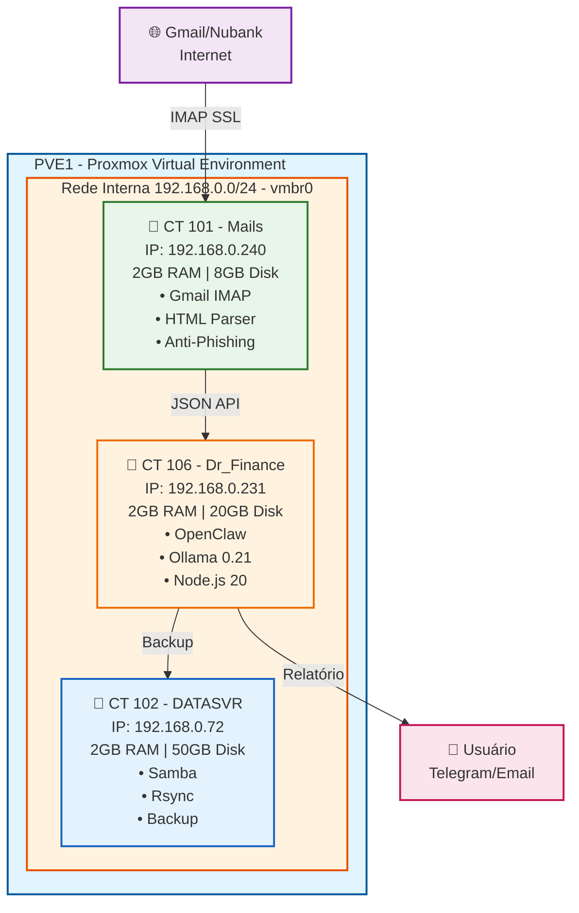
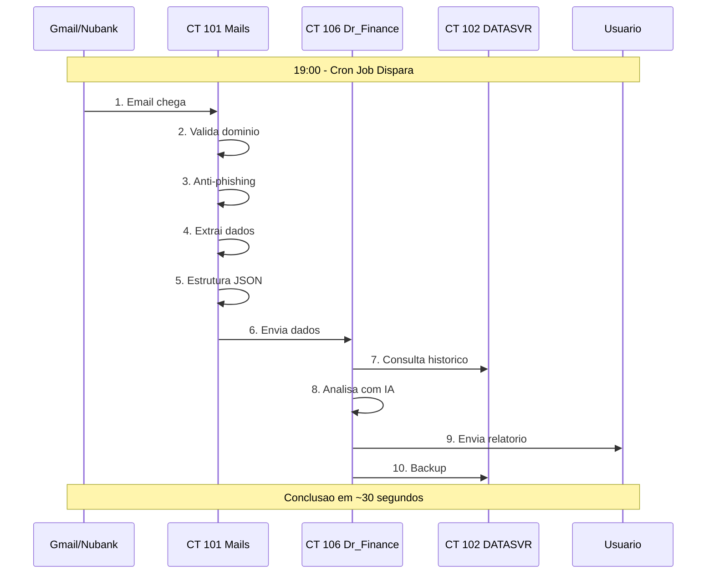
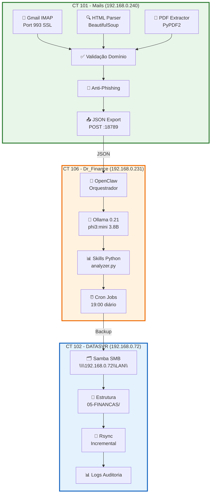
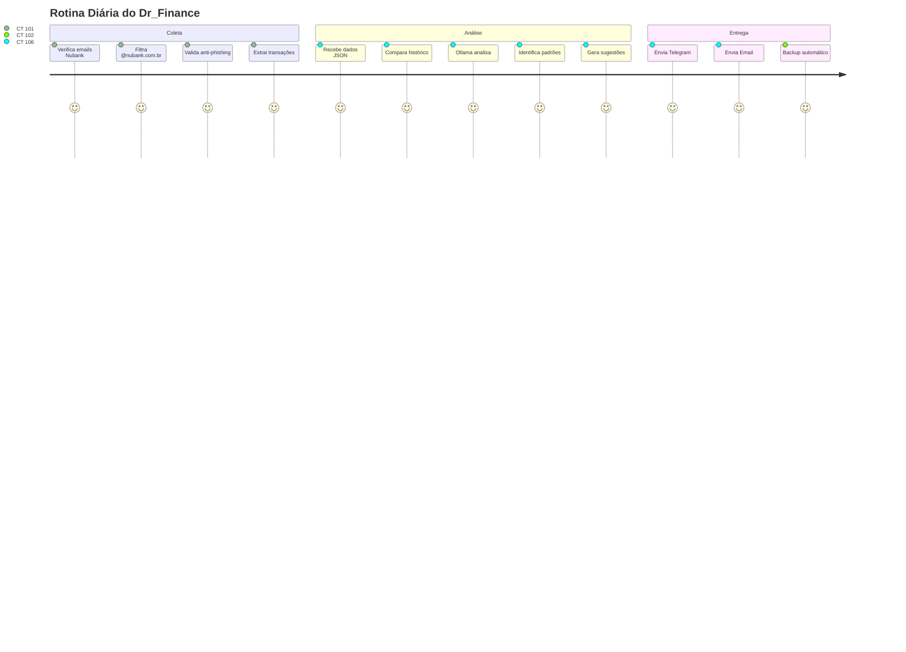
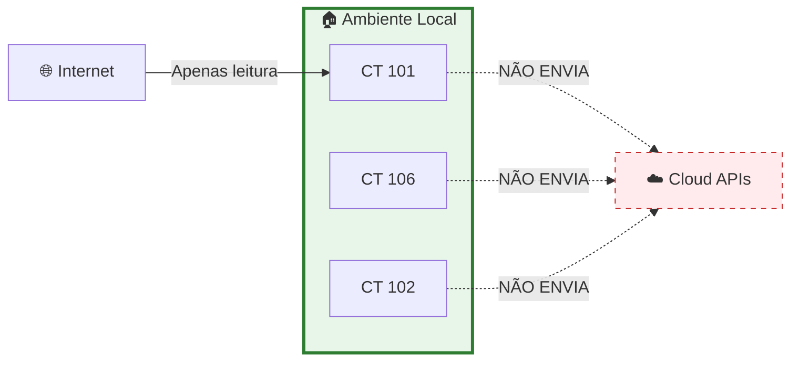

# Dr_Finance - Agente de Controle de Gastos Pessoais

> **Projeto desenvolvido por Acib ABBADE**  
> Bootcamp DIO - Lab BIA do Futuro

[]()
[]()
[]()
[]()

---

## 👋 Apresentação

Olá, sou **Acib ABBADE** e desenvolvi o **Dr_Finance** como projeto do Bootcamp DIO - Lab BIA do Futuro.

Escolhi criar um **agente de controle de gastos pessoais** porque identifiquei que 90% das pessoas não têm controle real dos seus gastos. Recebemos extratos do banco todos os dias, mas não analisamos padrões.

Minha solução automatiza essa análise usando IA local, garantindo privacidade total dos dados.

---

## 🏗️ Minha Arquitetura: 3 Containers Proxmox

Decidi usar **3 containers no Proxmox** para isolar cada função do sistema:

### **📊 Diagrama 1: Arquitetura do Ecossistema**



---

### **🔄 Diagrama 2: Fluxo de Dados (10 Passos)**



---

### **🔧 Diagrama 3: Arquitetura Técnica por Camadas**



---

### **📊 Resumo dos 3 CTs:**

| CT | Nome | IP | Função | Recursos | Software Principal |
|----|------|-----|--------|----------|-------------------|
| **101** | Mails | 192.168.0.240 | Coleta e valida emails | 2GB RAM, 2 cores, 8GB | Gmail API, HTML Parser, Anti-Phishing |
| **102** | DATASVR | 192.168.0.72 | Backup e histórico | 2GB RAM, 2 cores, 50GB | Samba, Rsync, ZFS |
| **106** | Dr_Finance | 192.168.0.231 | Análise com IA | 2GB RAM, 2 cores, 20GB | OpenClaw, Ollama, Node.js |

---

## 🛠️ Tecnologias que Usei

### **Infraestrutura:**

**3 Containers Proxmox:**

| CT | RAM | CPU | Disk | Função |
|----|-----|-----|------|--------|
| 101 | 2GB | 2 cores | 8GB | Coleta emails |
| 102 | 2GB | 2 cores | 50GB | Backup |
| 106 | 2GB | 2 cores | 20GB | Análise IA |
| **Total** | **6GB** | **6 cores** | **78GB** | - |

### **Stack Tecnológico:**

| Camada | Tecnologia | Versão | Finalidade |
|--------|------------|--------|------------|
| **Hipervisor** | Proxmox VE | 8.x | Virtualização |
| **Container** | LXC | 5.x | Linux Containers |
| **SO** | Ubuntu | 25.04 | Sistema base |
| **Orquestrador** | OpenClaw | 1.0 | Agente AI |
| **IA Local** | Ollama | 0.21.0 | LLM runner |
| **Modelo** | phi3:mini | 3.8B | Análise texto |
| **Runtime** | Node.js | 20.x | JavaScript |
| **Backup** | Samba | 4.x | Compartilhamento |
| **Rede** | Bridge vmbr0 | - | 192.168.0.0/24 |

### **Dados Mockados:**
- **19 transações** simuladas (gasolina, pedágio, almoço, lavanderia)
- **Perfil de investidor** completo (moderado, R$ 12k/mês, R$ 450k investidos)
- **6 produtos financeiros** cadastrados

---

## 📊 Como Funciona na Prática

### **Rotina Diária Automática (19:00):**



### **Exemplo de Relatório:**

```
📊 Relatório Financeiro - 19/04/2026

Resumo:
• Gastos: R$ 320,00
• Receitas: R$ 5.000,00
• Saldo: +R$ 4.680,00

Por Categoria:
• Combustível: R$ 150,00 (47%) ⚠️
• Alimentação: R$ 120,00 (38%)
• Transporte: R$ 45,50 (14%)
• Serviços: R$ 70,00

💡 Sugestão:
"Reduzir jantares fora gera economia de R$ 560/mês"
```

---

## 🔒 Por que Escolhi Essa Arquitetura

### **Privacidade Total:**



### **Segurança em Camadas:**

| Camada | Proteção | Implementação |
|--------|----------|---------------|
| **1** | Validação de Domínio | @nubank.com.br obrigatório |
| **2** | Anti-Phishing | SPF/DKIM + Blocklist |
| **3** | Container Isolado | CT 106 separado para finanças |
| **4** | Rede Interna | 192.168.0.0/24 sem acesso externo |
| **5** | Backup Recuperável | CT 102 com histórico |

### **Custo Zero:**
- ✅ Hardware próprio (sem mensalidades de cloud)
- ✅ Software open-source (Ollama, OpenClaw, Python)
- ✅ Sem APIs pagas de banco

---

## 📁 Estrutura do Repositório

```
dr-finance/
├── README.md              # Este arquivo (explicação do projeto)
├── PITCH-3MINUTOS.md      # Roteiro da apresentação (3 min)
├── docs/                  # Documentação técnica
│   ├── 01-documentacao-agente.md
│   ├── 02-base-conhecimento.md
│   ├── 03-prompts.md
│   ├── 04-metricas.md
│   └── 05-pitch.md
├── data/                  # Dados mockados
│   ├── transacoes.csv           (19 transações)
│   ├── historico_atendimento.csv (14 atendimentos)
│   ├── perfil_investidor.json   (Perfil completo)
│   └── produtos_financeiros.json (6 produtos)
├── src/                   # Código futuro
├── examples/              # Exemplos
└── assets/                # Imagens
```

---

## 🚀 Como Instalar (se quiser replicar)

### **Pré-requisitos:**
- Proxmox VE instalado
- Acesso ao host PVE1 (192.168.0.192)
- Credenciais root (não compartilhar)

### **Comandos que Usei:**

```bash
# ═══════════════════════════════════════════════════════════════
# CT 101 - MAILS (Coletor de Emails)
# ═══════════════════════════════════════════════════════════════
pct create 101 local:vztmpl/ubuntu-25.04-standard_25.04-1.1_amd64.tar.zst \
  --hostname mails \
  --net0 name=eth0,bridge=vmbr0,ip=192.168.0.240/24,gw=192.168.0.1 \
  --memory 2048 --swap 1024 --cores 2 \
  --rootfs local-lvm:8 --features nesting=1 --onboot 1

# ═══════════════════════════════════════════════════════════════
# CT 102 - DATASVR (Armazenamento e Backup)
# ═══════════════════════════════════════════════════════════════
pct create 102 local:vztmpl/ubuntu-25.04-standard_25.04-1.1_amd64.tar.zst \
  --hostname datasvr \
  --net0 name=eth0,bridge=vmbr0,ip=192.168.0.72/24,gw=192.168.0.1 \
  --memory 2048 --swap 1024 --cores 2 \
  --rootfs local-lvm:50 --features nesting=1 --onboot 1

# ═══════════════════════════════════════════════════════════════
# CT 106 - Dr_Finance (Análise com IA)
# ═══════════════════════════════════════════════════════════════
pct create 106 local:vztmpl/ubuntu-25.04-standard_25.04-1.1_amd64.tar.zst \
  --hostname dr-finance \
  --net0 name=eth0,bridge=vmbr0,ip=192.168.0.231/24,gw=192.168.0.1 \
  --memory 2048 --swap 1024 --cores 2 \
  --rootfs local-lvm:20 --features nesting=1 --onboot 1

# ═══════════════════════════════════════════════════════════════
# INSTALAÇÃO DE SOFTWARE NO CT 106
# ═══════════════════════════════════════════════════════════════
# Instalar Ollama (IA local)
pct exec 106 -- curl -fsSL https://ollama.com/install.sh | sh

# Instalar OpenClaw (orquestrador)
pct exec 106 -- npm install -g openclaw

# Baixar modelo LLM (phi3:mini - 3.8B parâmetros)
pct exec 106 -- ollama pull phi3:mini

# Configurar modo CPU-only (GPU AMD ROCm com problemas)
pct set 106 --env OLLAMA_CPU_ONLY=1
```

---

## 📊 Dados Mockados que Criei

### **transacoes.csv (19 transações):**

| Data | Descrição | Categoria | Valor |
|------|-----------|-----------|-------|
| 2026-04-19 | Posto Ipiranga | Combustível | R$ 150,00 |
| 2026-04-19 | Shell Box | Combustível | R$ 145,00 |
| 2026-04-18 | Fogo de Chão | Alimentação | R$ 280,00 |
| 2026-04-18 | McDonald's | Alimentação | R$ 45,00 |
| 2026-04-17 | Pedágio SP-Rio | Transporte | R$ 45,50 |
| 2026-04-17 | Lavanderia | Serviços | R$ 70,00 |
| 2026-04-15 | Salário | Renda | R$ 5.000,00 |

### **perfil_investidor.json:**
- **Perfil:** Moderado
- **Renda:** R$ 12.000/mês
- **Investimentos:** R$ 450.000
- **Metas:** Reserva de emergência, Aposentadoria, Viagem anual

---

## 🎓 Sobre o Projeto

**Bootcamp:** DIO - Lab BIA do Futuro  
**Autor:** Acib ABBADE  
**Problema Escolhido:** Controle de gastos pessoais  
**Solução:** Agente que analisa emails do Nubank e sugere economia

### **Status:**
- ✅ Documentação completa
- ✅ 3 containers criados (CT 101, CT 102, CT 106)
- ✅ Dados mockados cadastrados
- ✅ 6 diagramas Mermaid profissionais
- ✅ Pitch de 3 minutos

### **Próximos Passos:**
- ⏳ Finalizar instalação do OpenClaw no CT 106
- ⏳ Configurar cron jobs (19:00 diário)
- ⏳ Testar integração completa (Mails → Dr_Finance → DATASVR)

---

## 📞 Contato

**Acib ABBADE**  
Telegram: [@Acib_Abbade](https://t.me/Acib_Abbade)  
Email: abbade@outlook.com  
GitHub: [acibabbadecastro](https://github.com/acibabbadecastro)

---

> **"Desenvolvi este projeto para automatizar o controle de gastos pessoais, garantindo privacidade total dos dados usando IA local."**  
> — Acib ABBADE

**Última atualização:** 20/04/2026 00:10  
**Ecossistema:** 3 containers (CT 101-Mails, CT 102-DATASVR, CT 106-Dr_Finance)
